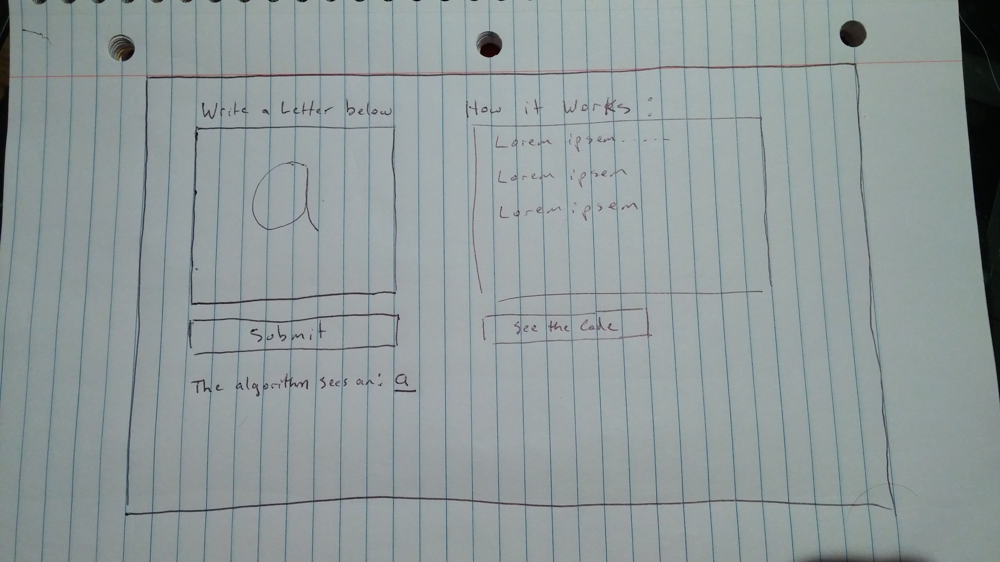

# Handwriting Recognizer

##Background

Some problems are difficult to express algorithmically, which makes them difficult to solve using computers. One well known example of this concept is optical character recognition (OCR) - handwritten characters are trivial to recognize by most humans, but because of the myriad exceptions to any predefined rules about writing, the same recognition by computer is not so easy. Artificial Neural Networks (ANN) are one approach to solve such problems with computers. The idea is to take a large number of handwritten digits, known as training examples, and then develop a system which can learn from those training examples.

## Functionality and MVP
This site will allow users to:
  - Enter a handwritten character into a browser
  - The site will process that character with an ANN and output it's characterization.

## Wireframes

## Technologies and Technical Challenges

This site will utilize Javascript, React, and HTML for overall functionality.

The OCR functionality will be done using Python and TensorFlow.

The primary challenges will be:
 - training the algorithm to recognize characters with high accuracy
 - learning Python/TensorFlow
 - integrating this functionality with the front-end to make the user experience simple and seamless.

## Implementation Timeline

### Day 1: Get Everything Set Up
 - get TensorFlow properly installed
 - research and get a general understanding of what needs to be done to draft and train the algorithm

### Day 2: Get the Algorithm Working
 - Decide on proper algorithm/node structure for OCR problems
 - Build it out and feed sample Data

### Day 3: Write website structure
 - Package.json - figure out how to integrate python/TensorFlow - does it need a back end?
 - Compose basic HTML page with canvas element for input

### Day 4: Integrate and style
 - Ensure functionaility of all the pieces together
 - Add css to site
 - figure out hosting
